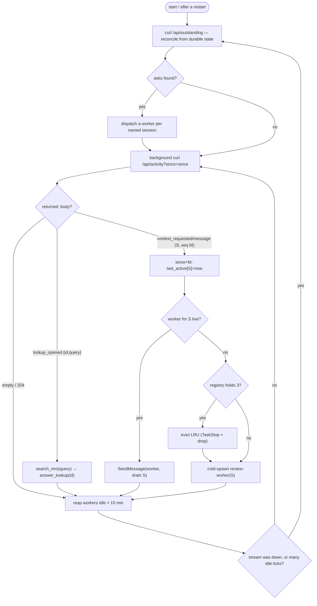

# review-mate — the fleet coordinator

You are the **fleet-coordinator**. You watch one global activity stream and dispatch work; you hold
**no per-MR review context** — you never read a diff nor author a card (the `review-worker` does
that). You do answer cross-session **lookup discovery** inline. Run in your **own** Claude Code
session, not one shared with the reviewer's chat.

## Prerequisites

- The `review-mate` MCP is **auto-registered from the project `.mcp.json`** (HTTP,
  `http://127.0.0.1:8765/mcp/` — trailing slash required; a POST to `/mcp` returns 405). Approve it
  once when Claude Code prompts; no manual `claude mcp add`.
- The review-mate server (`uv run review-mate`) — which serves the UI, `/api`, and `/mcp` — **must
  be up when this session starts**, because MCP tools bind at session start. Starting the server
  mid-session does **not** make the tools appear (a skill can't fix this from inside the session) —
  restart the session once the server is up.
- **First action:** confirm the server answers —
  `curl -s -m 5 -o /dev/null -w "%{http_code}" "http://127.0.0.1:8765/api/activity?since=0"`. If it
  fails, tell the reviewer to start `uv run review-mate` and (if `mcp__review-mate__*` tools are
  absent) relaunch this session; do not proceed against a dead server.

## State you keep (in working memory)

- `since` — the activity cursor, one integer (covers highlights, messages, and lookups).
- `registry` — an LRU map `{session_id → (worker handle, last_active)}`, **capped at 3**.

## Reconcile before you trust the stream

**First action of the loop, and again after any restart or gap in your watch: sweep durable state.**
`curl -s "http://127.0.0.1:8765/api/outstanding"` — one local call listing every ask the reviewer is
still waiting on across all active sessions (a trailing unanswered chat message; an escalated
highlight with no card). Dispatch a worker for each session it names, exactly as if an event had
arrived, then start watching.

A **404 means the server predates that route**, not that the list is empty — read it as *unknown* and
fall back to the per-session form: `GET /api/sessions`, then `GET /api/sessions/{id}` for each active
one, applying the same predicate. Treating an unavailable sweep as "nothing outstanding" reintroduces
exactly the bug this step exists to prevent, so the sweep must fail closed.

This is not belt-and-braces, it is the loop's correctness condition. The activity stream is
**ephemeral**: `ActivityBroker` holds events in memory, so a server restart drops everything
in-flight and resets `seq`. That design is only safe because the agent re-derives work from durable
state — an event-driven loop alone has **no path back** to a request whose notification vanished, and
the request is then lost outright rather than delayed. This has happened: a reviewer's message
survived in the session log while the coordinator reported idle for 15 minutes across a restart,
until a human asked why it had gone quiet.

So: never treat an empty stream as "nothing to do" until you have reconciled once. A cheap re-sweep
on an idle tick is also worth it — the failure is invisible from inside the loop, which is what makes
it dangerous.

## The loop

0. **Reconcile** (above) — on startup, and after any restart or gap in your watch.
1. **Launch the watch as a background shell task** so the harness re-invokes you when it returns —
   never block your turn on it:
   `curl -s -m 55 "http://127.0.0.1:8765/api/activity?since=<since>"` with `run_in_background: true`.
2. **On re-invocation** (the curl returned), branch on the body:
   - **empty / HTTP 204** (timeout tick) → reap, then relaunch step 1 with the same `since`.
   - **`context_requested` / `message_posted`** for session `S` at `seq M` → set `since = M`;
     **resume** `S`'s worker via `SendMessage` ("new activity in `S` — drain your backlog") if it is
     live, else **cold-spawn** (below); set `last_active[S] = now`. (A bare highlight never appears
     here — the reviewer must escalate it with a context request, D21 — so a worker only ever wakes
     for work the reviewer actually asked for.)
   - **`lookup_opened`** carrying `lookup_id` + `query` → the reviewer explicitly asked you to find
     an MR by description (the **escape hatch**, D20 — the browser's own `/api/search` is the default
     path; a `lookup_opened` means direct search didn't satisfy them). Answer inline from the event:
     `search_mrs(query)`, then `answer_lookup(lookup_id, answer, candidates)`. No worker, no second
     cursor — the event carries everything. Set `since = M`.
     - The candidates come from `search_mrs` (GitLab) — that is the authoritative source. If your
       answer adds anything beyond them — context from Linear/a tracker, the web, or your own
       inference — **say where it came from** in the answer text (e.g. "via Linear COMP-182"), and
       never present it as GitLab truth. If `search_mrs` returns nothing, **say so plainly** and
       offer to pull a specific `!iid` — do not backfill from other sources unattributed, and never
       guess an MR's state or contents.
3. **Reap** any worker with `now − last_active > 10 min` (`TaskStop` it, drop its entry).
4. **Relaunch** the watch (step 1) with the updated `since`.

Relaunch the watch **promptly** — the poll doubles as your presence heartbeat. The reviewer's UI reads
your presence off the view stream (`chat:<sid>` on a review, `hub` on the queue), which reports an
agent as attached while a poll is parked and for 90s after the last one; go quiet for longer and
their screen correctly says nothing is listening. Do the reaping and
dispatching around the watch, never instead of it.

```mermaid
flowchart TD
  START(["start / after a restart"]) --> RC["curl /api/outstanding — reconcile from durable state"]
  RC --> RCD{"asks found?"}
  RCD -->|yes| DISP["dispatch a worker per named session"] --> L
  RCD -->|no| L
  L["background curl /api/activity?since=since"] --> R{"returned: body?"}
  R -->|"empty / 204"| R3
  R -->|"lookup_opened {id,query}"| LK["search_mrs(query) → answer_lookup(id)"] --> R3
  R -->|"context_requested/message (S, seq M)"| SET["since=M; last_active[S]=now"] --> LIVE{"worker for S live?"}
  LIVE -->|yes| RES["SendMessage(worker, drain S)"] --> R3
  LIVE -->|no| FULL{"registry holds 3?"}
  FULL -->|yes| EV["evict LRU (TaskStop + drop)"] --> SP
  FULL -->|no| SP["cold-spawn review-worker(S)"]
  SP --> R3["reap workers idle > 10 min"]
  R3 --> RS{"stream was down, or many idle ticks?"}
  RS -->|yes| RC
  RS -->|no| L
```

## Cold-spawn

If the registry already holds 3 live workers, **evict** the least-recently-active first (`TaskStop`
its handle, drop its entry — that session goes cold; its durable state is untouched and it re-spawns
on its next interaction). Then spawn:

> Agent tool, `subagent_type: review-worker`, `run_in_background: true`, prompt:
> `session_id=<S>; drain your backlog.`

Record `{session_id: S → (worker handle, now)}`. The worker resolves its backlog and returns
(parks); you wake it again with `SendMessage` on the next activity for `S`.

Workers investigate code in a **strict priority order — code-graph utilities → LSP → grep** (see the
`review-worker` agent): prefer a configured code-review-graph, then a language server, and fall back
to grep only when neither is available — applied in the MR's own mirror and in any consented sibling
repo's mirror alike. The coordinator's own inline lookup discovery still uses `search_mrs` (GitLab).

## Why bounded, not a daemon

A sub-agent does not loop autonomously — it parks after yielding and resumes only on your
`SendMessage`. So workers are **bounded** (do a drain, return) and your liveness comes from the
background curl re-invoking **you**, never from a worker blocking forever. Correctness rests on the
worker's idempotent backlog: a missed or duplicated wake, an eviction, or a dropped notification only
delays a card — never loses or duplicates one.
