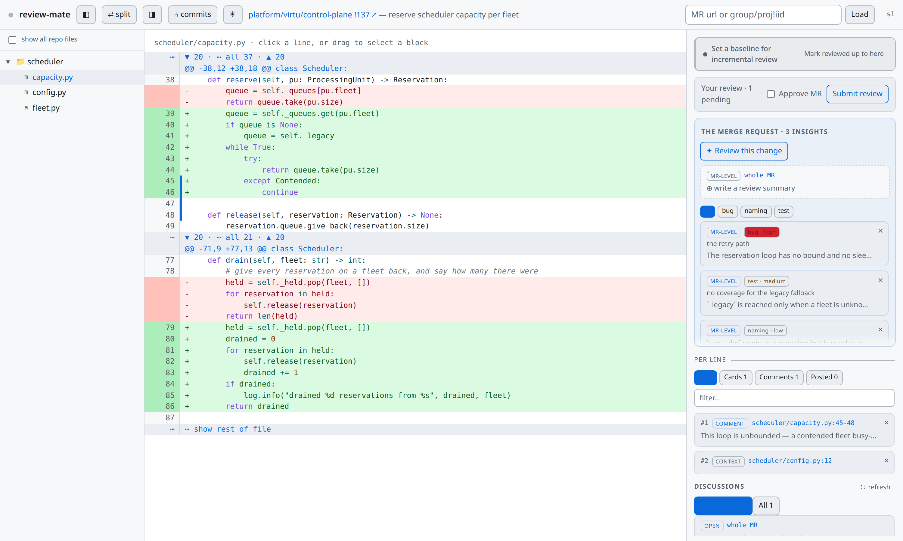

# review-mate

> [!WARNING]
> **This repository is a prototype.** The UX/UI is not yet refined and is sometimes clunky —
> rough edges, half-finished affordances and abrupt interactions are expected rather than
> surprising. It is shared in that state on purpose. **Feedback and merge/pull requests are very
> welcome**, especially on the parts that get in your way.

Code review where the agent works for you, not instead of you.

You read the change; Claude answers. Mark lines you have a question about and it tells you what it
found there. Ask for a pass over the whole change and it comes back with findings you can sort,
argue with and relabel. What it cannot do is act in your place: it never writes in your name,
nothing reaches the merge request until you send it, and it asks before reading a repository you
have not opened. The entire review works with no agent attached — that is a line the design holds,
not a setting you switch.

It reads a merge request from a forge, or a branch that has never left your machine. The second is
for work an agent has just written: you review it, and the agent that wrote it answers your comments
and makes the changes you ask for, before anyone else is shown it.

**GitLab is the only forge implemented** — self-hosted or gitlab.com. **GitHub is intended and not
built yet.** The review model is host-neutral and a forge sits behind a contract, so adding one is a
provider rather than a rework; that is a claim about the design, not a date. Reviewing a local
branch needs no forge at all.



**[What it does, in pictures →](docs/features.md)**

## How it works

review-mate runs as a local server that the browser talks to, and that Claude Code can attach to
over MCP:

```
browser  ⟷  local Python server (UI + /api + /mcp)  ⟷  Claude Code (MCP)
                        ⟷  GitLab
```

The design splits into two planes, and the split is load-bearing:

- **The host plane** — everything that talks to the forge: the diff, the review queue, search,
  comments, discussion threads, approvals. The server does all of it directly. **The whole review
  workflow works with no agent attached.**
- **The agent plane** — context cards, insights, chat, cross-repo lookups. Purely additive. Claude
  enriches the review; it never carries a host action the server can perform itself.

Sessions are event-sourced (an append-only log per session under `~/.review-mate/`), so a review
survives a server restart and resumes where you left it.

## Getting it

You need `git`, [uv](https://docs.astral.sh/uv/), and — for reviewing merge requests — either the
[`glab`](https://gitlab.com/gitlab-org/cli) CLI already authenticated or a GitLab API token.
Reviewing a local branch needs neither.
[Claude Code](https://claude.com/claude-code) is optional — the whole review works without an agent,
and marking lines still tells you who last touched them and what they are linked to.

```bash
uv tool install 'review-mate[tui] @ git+https://github.com/Joacchim/review-mate-prototype'
glab auth login          # if you have not already
review-mate              # http://127.0.0.1:8765
```

Upgrade with the same command and `--force`. Without it an existing install is audited and left
alone, which looks like success and changes nothing.

Working on review-mate rather than using it? [Contributing](CONTRIBUTING.md) has the setup for
that — it runs from a checkout, so an edit is one restart away.

Open <http://127.0.0.1:8765>. With no credentials at all it still starts — there is just no queue
and no merge request to load, which is enough to review a local branch.

To have it always there rather than started by hand, and for credentials, upgrading and
troubleshooting: **[running it →](docs/running.md)**.

## Using it

1. **Pick something to review.** The landing page shows your open reviews on top and your GitLab
   review queue below. Click an entry to open it, or **Track** it to start its session and keep
   triaging. You can also paste an MR URL or `group/project!iid` into the toolbar box.
2. **Read the diff.** Toggle the file tree (◧), the context panel (◨), unified/side-by-side (⇄), and
   per-commit review (⑃) from the header. Click the bands between hunks to unfold context.
3. **Mark what you want to know about.** Hold the left mouse button and drag across the lines. It
   appears in the panel on the right, already carrying what the host knows about those lines — who
   last touched them, and any issue that references them.
4. **Ask Claude if that is not enough.** Open it and use **✦ Ask Claude for context**,
   optionally with a specific question. The answer arrives as a card on that highlight. The header
   light tells you whether an agent is actually listening.
5. **Write your review.** Draft a comment on a highlight, or an MR-level one. Drafts stay local.
   When you are done, the review bar submits them all at once, optionally approving the MR.
6. **Come back later.** **Mark reviewed** sets a baseline; on your next visit, *Since your last
   review* shows only what the author changed since — as a normal diff, not a diff of diffs.

## Reading further

- **[Features](docs/features.md)** — what it does, in screenshots of the web UI
- **[Running it](docs/running.md)** — credentials, the systemd unit, the terminal client, attaching
  Claude, troubleshooting
- **[Architecture](docs/architecture.md)** — the view protocol and the two planes
- **[Surprising behaviours](docs/surprising-behaviors.md)** — behaviour that is correct by design and still catches
  people out
- **[Contributing](CONTRIBUTING.md)** — the development setup, the layout, and the test suites

## Feedback

This is a prototype and it is meant to be pushed on. Issues and merge/pull requests are welcome —
particularly on the interactions that feel clunky, since that is exactly what has not been refined
yet.
