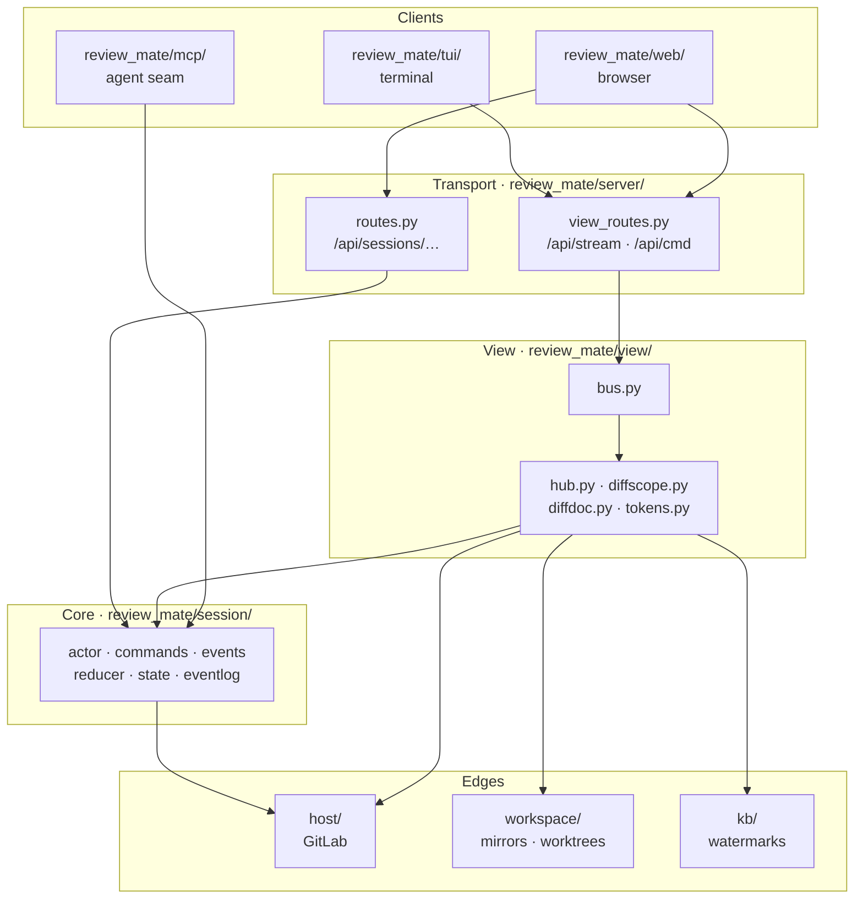
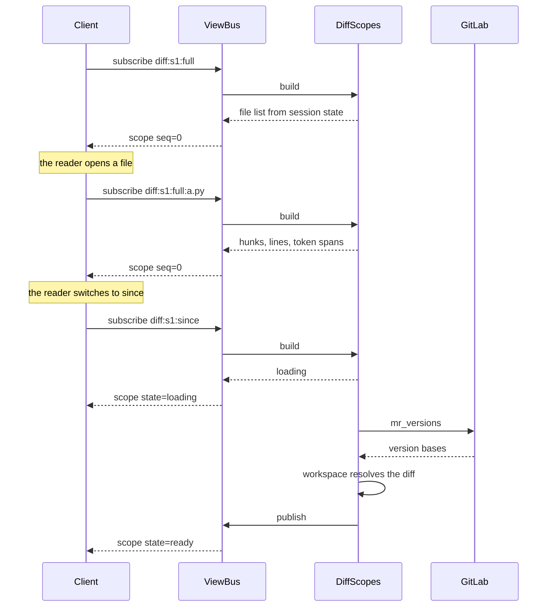

# Architecture

What the pieces are and how they fit. [The README](../README.md) says what the tool does;
[the glossary](glossary.md) defines the terms used here.

## Layers



| layer | holds | knows about |
|---|---|---|
| `session/` | the event-sourced review model | nothing below it |
| `seams.py` | the Protocols the core is written against | nothing below it |
| `host/`, `workspace/`, `kb/` | the forge, the clone area, the reviewer's watermarks | the core |
| `view/` | folding state into scopes | the core and the edges |
| `server/` | HTTP and websocket transport | everything above |
| `web/`, `tui/`, `mcp/` | clients | the transport only |

The core carries no host, transport or UI knowledge. `tests/boundary/test_boundaries.py` enforces
that by parsing imports: `session/*.py` and `seams.py` may not import `review_mate.view` or
`review_mate.server`, nor anything host- or MCP-shaped.

## The core

A session is an actor: commands in, events appended to a log, state folded from the log. The log is
the source of truth and is fsynced before a command is acked, so an acked change survives a crash.
State is restored by replay at startup.

Every command carries an origin, and an authority matrix decides what each origin may do. That is
how the agent plane stays additive: the agent can add a card, and cannot post a comment to the host.

## The view protocol

Clients render, and derive nothing. The server folds state into named **scopes** and sends each one
whole; a client subscribes by name and displays what arrives.

Whole-scope replacement is the load-bearing choice. It means a client needs no merge logic, and it
makes the slow-consumer policy fall out: an undelivered update is worthless once a newer one exists,
so a subscriber holds at most one pending frame per scope and the newest wins.

### The wire

One websocket, `/api/stream`. Client frames:

```json
{"action": "subscribe",   "scopes": ["hub", "diff:<sid>:full"]}
{"action": "unsubscribe", "scopes": ["diff:<sid>:full"]}
```

Server frames:

```json
{"type": "scope", "scope": "hub", "seq": 12, "view": {…}}
{"type": "error", "scope": "hub", "reason": "RuntimeError: host is down"}
```

Writes go to `POST /api/cmd` as `{"cmd": …, "args": {…}}` — `session.open`, `session.close`,
`hub.refresh`, `session.resync`, `review.submit`, `review.mark_reviewed`, and the thread verbs
`thread.reply` / `thread.resolve` / `thread.edit_note` / `thread.delete_note`. A rejection
answers with a status code and a reason, and the status carries meaning: 400 on
`session.open` means the reference did not parse.

Sending a review is a command rather than a route because both clients send one, and the order it
runs in is the part worth having once: a comment the host refuses must not sink the rest, the
discussions are re-mirrored before the reviewer looks for what they just posted, and approving
follows posting rather than racing it.

### The scopes

| name | carries |
|---|---|
| `hub` | open reviews with their verdicts, and the host review queue |
| `diff:<sid>:<mode>` | the file list and the MR |
| `diff:<sid>:<mode>:<path>` | one file's hunks, lines and token spans |
| `blob:<sid>:<mode>:<path>` | a whole file at the resolved sha, for unfolding |
| `rail:<sid>` | the session's highlights with their cards and cheap context, and MR-level insights |
| `chat:<sid>` | an index of the review's conversations, and the agent state it is in |
| `chat:<sid>:review` | the conversation about the change as a whole |
| `chat:<sid>:<kind>:<id>` | one subject's conversation — kind is highlight, insight or thread |
| `review:<sid>` | the comments prepared to send, whether the change moved on, and who has approved |
| `threads:<sid>` | the discussions already on the merge request, and which comments are the reviewer's |
| `access:<sid>` | repositories Claude has asked to read, and what the reviewer decided |
| `tree:<sid>` | every file in the repository at the change's sha, for browsing beyond the diff |
| `commits:<sid>` | the commits the change is made of, for reviewing one at a time |

`tree` and `commits` each cost a host read, so both are fetched when someone starts watching and
never while nobody is — which a route cannot arrange, because a route is asked whether anyone is
looking or not. Until the answer lands the view says `loading`, so a client shows that rather than
waiting on it.

A file's scope name is the list's name with a path appended, so a client concatenates rather than
assembling a second name. Names are validated: a path may contain a colon, a session id and a mode
may not, and a malformed name reports `malformed-name` instead of being read as a plausible path.

### Conversations

A message carries a **subject**: a highlight, an MR-level insight, or a host thread — or nothing,
which is the review's own conversation. The kinds are exactly what a client can open a detail panel
on, so a conversation renders where its subject already does.

Each subject therefore has two channels, and they are never one list: the **agent** channel (its
card and the conversation about it) and the **review** channel (the host thread other participants
see). They differ in authorship, durability and write path — a session command against host
write-back — so a client composes them, and an internal message can never become a posted one by
accident.

`view.asks` owns what the review is waiting for, and `chat:<sid>` publishes the join of that with
presence. Presence answers only "is anyone listening"; a watcher parked in `wait()` is idle by
definition. "Is my ask being worked on" is the join, and no client performs it:

| | an ask is outstanding | nothing outstanding |
|---|---|---|
| **an agent is attached** | `working` | `watching` |
| **none is** | `stalled` | `off` |

`stale` qualifies `working`: an agent is attached, but the ask has sat long enough that "being
worked on" is no longer the likely explanation — the case a restart strands, since the activity
stream is ephemeral.

A thread that vanishes on a host re-sync keeps its conversation. The host reconciling is not the
reviewer discarding — a discussion can leave because someone resolved and deleted it, or because a
system note was filtered — and what the reviewer wrote about it privately is still theirs. The
conversation is then reachable on the wire and not from any rail, which costs an orphan and is the
cheaper mistake of the two.

An agent's own question back to the reviewer is not an ask. Nothing distinguishes a question from a
statement in a message body, and inventing the distinction would report the reviewer's silence as
the agent's debt.

### Rules a scope holds to

- **Building a scope never calls the host.** Host reads are separate methods, driven by a command or
  a one-shot loader, so a rebuild cannot turn into a fan-out of network calls.
- **A slow source reports itself.** A scope that must reach the host or the workspace reports
  `loading` and republishes when the answer lands, rather than blocking the frame.
- **Freshness tiers stay distinct.** Local state rebuilds on every publish. An automatic host read
  carries its own state field. A fan-out across reviews runs only on an explicit refresh, and its
  subjects report whether they have been checked.
- **Derivations live in the scope.** Verdicts, counts and row order are the server's. Two clients
  computing the same thing will eventually disagree.
- **A builder failure is an error frame**, never an exception at the client. The subscription
  survives, and a later publish can succeed.
- **Nothing is built for a scope nobody watches**, though `seq` still advances, so a late subscriber
  learns how current its first view is.
- **A republish that produced the same view is not sent**, and does not advance `seq` — there is no
  change for a later subscriber to have missed. Republishing is deliberately coarse (a session
  rebuilds every scope it holds, rather than tracking which scopes an event could touch), and the
  difference check is what makes that affordable: a tokenized file dwarfs every other frame, and a
  highlight or a message leaves it untouched.
- **Work that only makes sense while someone is looking starts and stops with the watching.** The
  bus reports when a scope gains its first watcher and loses its last, and the tail on a session's
  events — which is what republishes its reading scopes when its state changes — runs exactly
  between those two moments.

### Reading a change



Switching mode is a subscription, not a command — which is why no mode command exists to fall out of
step with what a client is showing.

## Session documents

There are two write paths, and the line between them is deliberate: **`/api/cmd` addresses the set
of reviews and the host; `/api/sessions/{id}/commands` addresses the contents of one review.**
Opening, closing and refreshing are about which reviews exist; highlights, cards, drafts and
messages are about what is inside one.

Alongside the view protocol, the session document is served directly: `GET /api/sessions/{id}`
returns the folded state, `POST /api/sessions/{id}/commands` submits a session command, and a
per-session websocket streams its events. A client reads what the scopes fold — highlights, their
cards and the cheap tier all arrive on `rail:<sid>` — and reaches for the document only for what no
scope carries: drafts under edit, threads, chat. The agent reaches the same sessions in-process
through the MCP bridge rather than over HTTP.

It reads the same folded scopes, through the same instances. `get_session` composes the rail, the
chat index, the discussions and the consent list rather than returning the session document, so
there is one representation of a review and not one per audience. That is what stopped the
outstanding-asks predicate being worked out in three places, and it is why the agent's backlog is
read from `chat.asks` rather than derived.

Two things it is not given. The diff has its own call, and that call answers with a *map* — which
files changed and by how much — rather than the change itself. The agent has the merge request on
disk: `checkout_path` is a real worktree off the bare mirror, and `mr.diff_refs` carries the base
and head shas, so it can read any file at head, recover any old side with `git show`, and compute
any range it wants without asking. What it cannot cheaply work out is where to look, and that is
what the map is for. One file's unified diff text is still reachable by path, for the session whose
checkout failed to materialize and is running over the host API alone.
And the reviewer's unposted drafts are absent at every stage: a draft is private prose until they
post it, at which point it is a discussion and the agent reads it in `threads` like everyone else.
No filter enforces that; the review scope is simply not part of the agent's view.

## Clients

The browser and the terminal client both render scopes and send commands, and neither models review
state. A client owns only presentation: mapping token kinds to a palette, deciding how much unfolded
context to show, choosing a layout.

That is what makes a second client cheap, and it is enforced by having one:
[the web UI testing method](testing/web-ui.md) covers the browser, and the terminal client's own
tests cover the same protocol from the other side.
