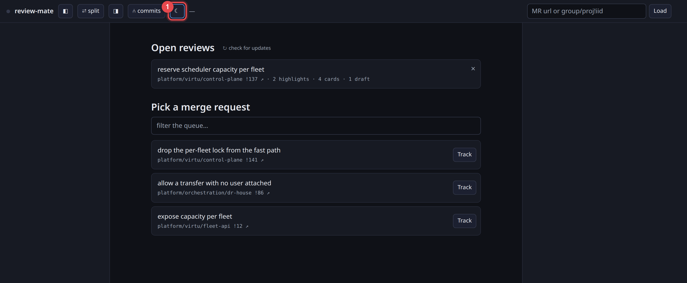
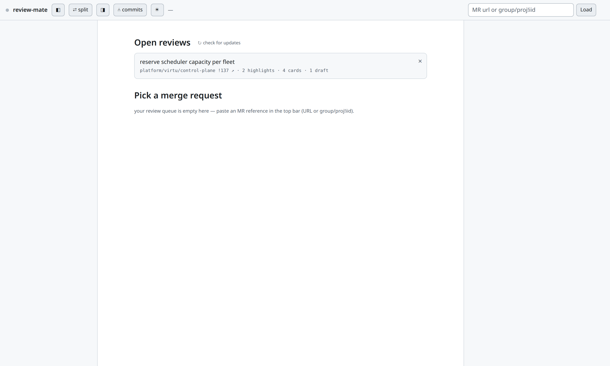
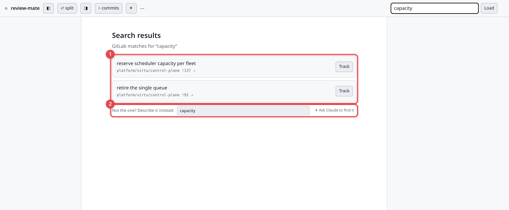
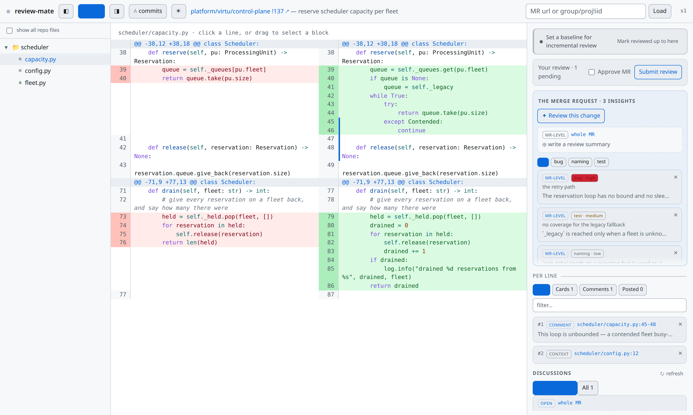
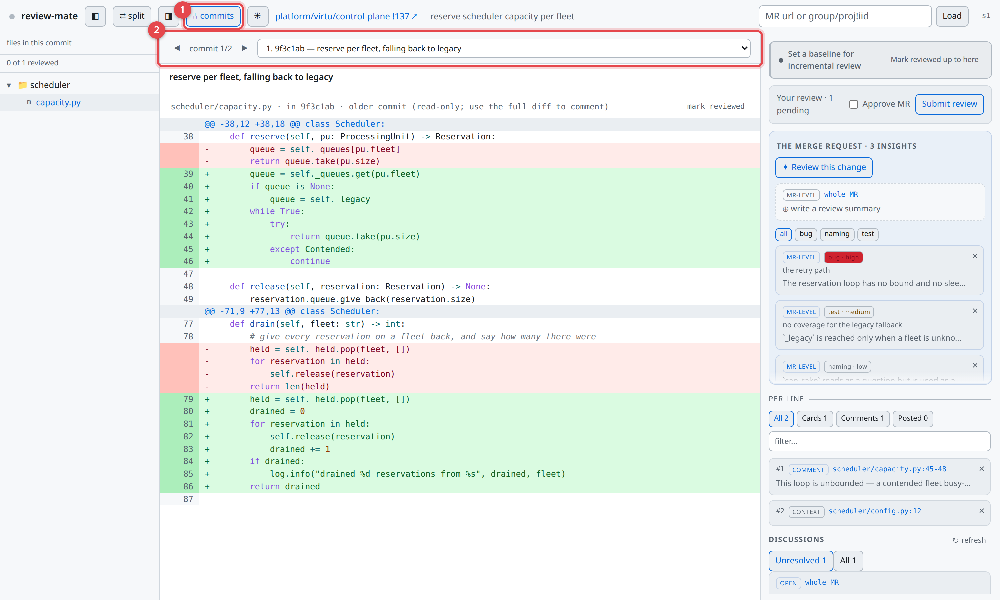
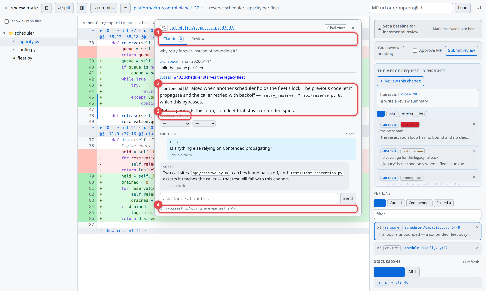
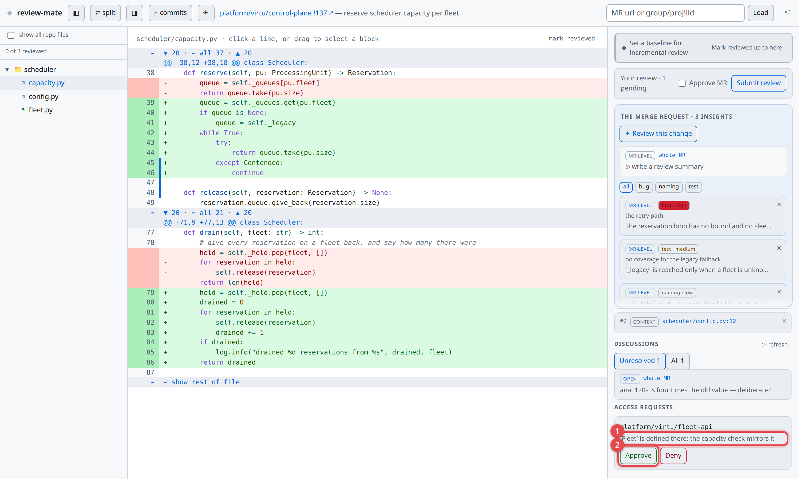
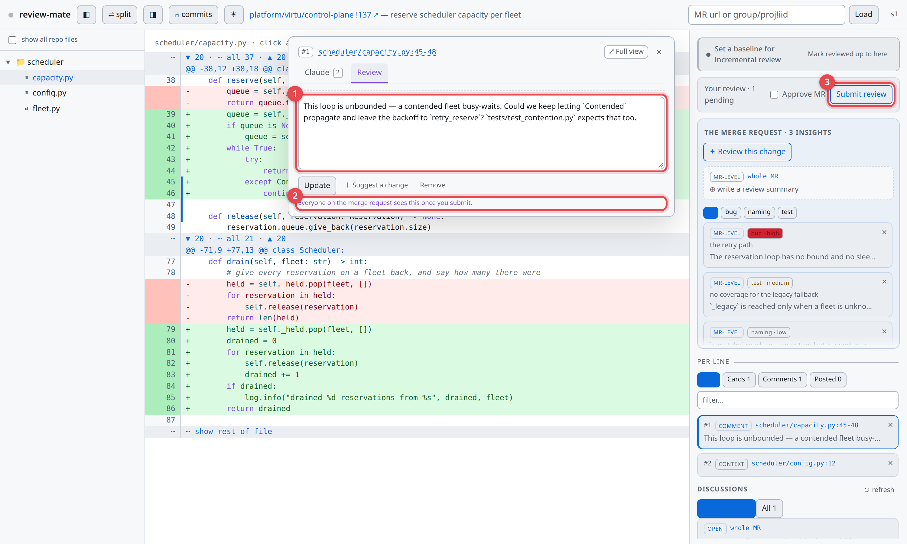
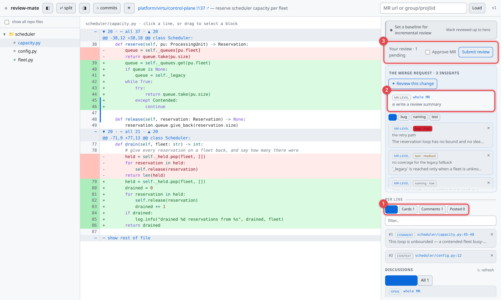
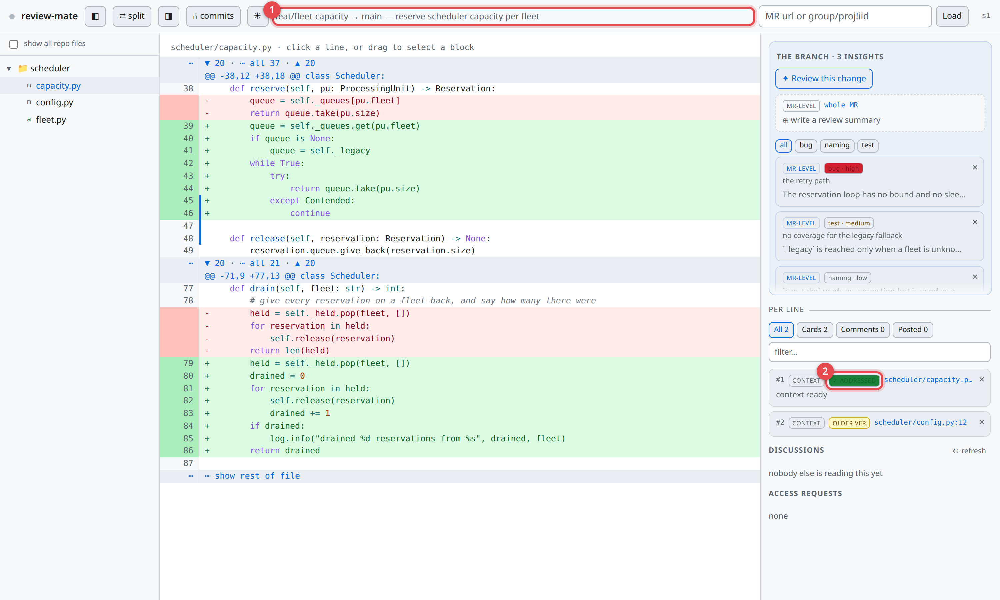

# What review-mate does

The web UI is the native client — everything below is a screenshot of it. A terminal client covers
the same protocol and an agent reads the same data over MCP, but the browser is where the product is
meant to be seen.

Every picture here is generated by `tools/screenshots.py`, which drives the real application. If a
screen has changed, regenerate them rather than describing the difference.

## Light or dark

The whole interface comes in both, and the toggle in the header switches between them. The choice is
remembered, so it survives a reload and applies to every review you open.

> ① the theme toggle

The next picture is this same page in the light theme, and everything after it is light too.

## Finding something to review

This is the landing page — where review-mate opens when it is not showing a particular change.

> ① paste a merge request URL, or `group/project!iid`, or type words to search for one · ② reviews
> you already have open, with what has happened to each since you last looked · ③ the queue: merge
> requests where you are a reviewer or an assignee

Both lists are made of real links, so a review can be middle-clicked into its own tab. **Track**
starts a session on a queued merge request without leaving the page, and a review you already have
open says what changed while you were away: the branch moved, discussions were opened, it was
merged or closed.

Typing in the box at the top **replaces this page with search results** as you type. They are not a
dropdown over the page, so there is nothing to dismiss: emptying the box builds the landing page
again, from the same state it was showing before.

> ① what the forge matched, each one ready to track or open · ② the way through to Claude, for when
> you can describe the change but not name it

The search is the forge's own, so it matches titles and descriptions. When that is not enough —
you remember what the change *did* but not what it was called — describe it instead and Claude
looks for it. That box is separate from the search box on purpose: what a search wants is a term,
and what Claude wants is a description, and overwriting one with the other would throw away the
answer you are reading.

## Reading a change

A change is read in three panels, side by side.

> ① the files in the change · ② the diff itself · ③ the review panel, which holds everything you
> have marked and everything Claude has said · ④ ⑤ hide either side panel to give the diff the
> width · ⑥ which change you are reading, linking back to it on the forge

The review panel stays put while you move between files, so what you have collected does not
scroll away with the code. The diff has syntax highlighting, and the context between hunks can be
unfolded a screen at a time or all at once — or you can open the rest of the file, read at the
merge request's head.

There is more here than a diff normally gives you. Files the change did not touch are browsable —
the whole repository tree, not only what moved. Markdown renders as text rather than as a diff. A
renamed file shows as a path divergence with both ends visible.

**Two versions at once.** `⇄ split` puts the old and the new side by side instead of interleaved.

**One commit at a time.** `⑃ commits` steps through the change commit by commit, which is usually
how work that arrived in several passes is easiest to follow.

> ① switch into per-commit reading · ② the commits, in order, with the diff showing one at a time

**Since your last review.** Mark a baseline, come back later, and see a normal per-file diff of what
the author changed since — with target-branch noise excluded, so a rebase does not read as a hundred
new files.

## Asking about a line

Press the left mouse button on a line in the diff and drag down to the last line you mean, then
release. That marks the range, and an entry for it appears in the review panel on the right —
along with what the host can already tell you about those lines: who last touched them, and any
issue that references them. Nothing was asked of anyone to get that.

Clicking that entry opens it.

> ① the two channels this subject has — see below · ② what Claude found, anchored to the lines you
> marked · ③ doubt a claim and ask for it to be checked · ④ the reminder that this channel is yours
> alone

**The two tabs are two different audiences, and they never mix.** *Claude* is a private channel:
the context, and a conversation about it that only you can see. *Review* is what the merge request
will see — the comment you are preparing for everyone else. Nothing written in one can leave by the
other, which is the reason they are separate tabs rather than one box.

When the automatic context is not enough, ask Claude for more and its answer arrives in the same
place, anchored to the same lines. If an answer looks wrong, **double-check** (③) asks for it to be
verified rather than taken on trust.

A presence indicator says whether an agent is actually watching, so a slow answer never looks like
a lost one.

## Claude's own read of the change

> ① ask for a pass over the whole change · ② what a finding is about, and how much it matters ·
> ③ narrow the list to one kind

**Review this change** asks for a pass over the whole thing, alongside your own rather than instead
of it. What comes back is classified — what each finding is about, and how much it matters — so
forty findings are a list you can read worst-first or narrow to one kind, rather than one you read
top to bottom or not at all.

The classification is Claude's claim, and you can disagree with it in place. A finding labelled
`bug · high` that is really a naming preference costs you attention on every scan; relabelling it
keeps the finding and fixes the label.

> ① why it wants the repository · ② your answer, and nothing is read until you give one

Claude asks before reading anything outside the change, and nothing is read until you answer. A
refusal stays visible — an agent asking again for what you refused reads differently from one asking
the first time.

## Writing the review

> ① the comment, editable until you send it · ② who will see it, once you do

Each marked range can carry a comment. Nothing reaches the forge as you write: you prepare the
whole review, read it back, and send it in one go.

> ① what state each marked line is in · ② the change as a whole: a summary comment, and a
> conversation with Claude about the change rather than about one line · ③ what is waiting to go,
> and the approval that can go with it

The counts at ① are also filters. **Cards** are ranges you have collected context on and not written
anything about; **Comments** are the ones with a comment prepared; **Posted** are the ones already
on the merge request. It is the difference between what is still yours and what the team has seen,
and it is the quickest way to answer "what have I actually written so far?".

The merge request as a whole is a subject like any line is (②) — it takes a summary comment, and it
has its own conversation with Claude, for the questions that are about the change rather than about
one place in it.

The merge request's existing discussions are here too. Filter to what is unresolved, jump from a
thread to the line it is anchored to, reply, resolve, and edit or delete your own notes.

## Reviewing your own work first

> ① named by where it is going, since there is no merge request number to show · ② the agent changed
> the code here, so its lines moving is progress rather than a warning

The same review, of a branch that has not left your machine — no merge request, nothing to post to,
and no one else reading it yet. It is for work an agent has just written, read by the person about
to put their name on it.

The difference is what a comment means. On a merge request you write a comment for the author to
read later; here, the agent that wrote the code is watching, so a comment is answered — by
discussion where you asked a question, and by changing the code where you asked for a change. A
subject the agent has acted on says what it became, rather than warning you that your marked lines
are now out of date.

Start it from an agent session with `/self-review`, and the agent hands you the link.

## Hosts

**GitLab** — read and write, self-hosted or gitlab.com. The only forge implemented. Which project
and merge request you are reading is in the header (⑥ in *Reading a change*), and it links back to
the forge.

**GitHub** — intended, and not built. Nothing in the review model is GitLab-shaped: what a forge can
do is advertised as capabilities, and the parts of the UI a host cannot serve turn themselves off
rather than being special-cased. So a second forge is a provider behind the existing seam. That is
what the design buys, not a promise about when.

**A branch on this machine** — needs git and nothing else. No forge, no token, and the review works
the same way apart from the parts that need somewhere to post to. The header then names the branch
and links nowhere, because there is nowhere to go.
