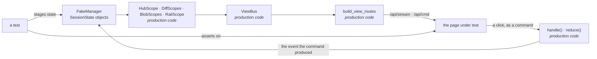

# Testing the web UI

Every change to `review_mate/web/` ships browser tests. The UI is the half of the system no other
gate covers: the protocol tests prove what the server sends, and nothing else proves the browser
does the right thing with it.

Scopes, views, frames and modes are defined in [the glossary](../glossary.md); how the view protocol
fits together is in [the architecture](../architecture.md).

## Stack

- **Playwright** through `pytest-playwright`, so the browser suite is part of `uv run pytest` and
  there is one gate.
- **Chromium and Firefox**, both on every run. pytest-playwright runs chromium alone unless told
  otherwise, so `tests/conftest.py` defaults the list to both; `--browser` still narrows it.
- Browsers install with `playwright install --with-deps chromium firefox`.

```bash
uv sync --extra webtest
uv run playwright install chromium firefox
uv run pytest tests/webui                       # both browsers
uv run pytest tests/webui --browser firefox     # one
uv run pytest tests/webui --headed --slowmo 300 # watch it
```

Run this suite in its own invocation. pytest-playwright's fixtures are synchronous and the other
suites are `asyncio_mode = auto`, so collecting both in one session leaves the async tests
unawaited and reports them as failures that have nothing to do with the code. The gate is
`uv run pytest --ignore=tests/webui` plus `uv run pytest tests/webui`, and CI runs them as separate
jobs for the same reason.

## Architecture

### Stub the host, never the protocol

The fixture server is the production server with its data source replaced. `build_view_routes`,
`ViewBus` and every scope builder are the real ones, so frames on the wire are produced by the same
code as in production and validated by the same models. No test writes protocol JSON by hand.



Scenarios are built from the real state models — `MRMetadata`, `FileEntry`, `Highlight` — never
from dicts, and commands run the production `handle()` and `reduce()`, so a click lands in staged
state the way it lands in production and the session tail republishes the scopes that hold it.
What `FakeManager` fakes is durability: there is no event log, and `seq` is counted in the fake.

A test can also act as a plane the browser is not: `as_agent` submits a command on the fixture
server's own loop, which is how a card arrives on a view that is already open.

### Two entry points

| fixture | server | use for |
|---|---|---|
| `staged_app` | `FakeManager` + real view layer | the default. Any state, set directly: a queue that fails, a file still resolving, `head_aligned` false, a malformed scope name |
| `live_app` | real `create_app` + stub GitLab host | the anchor set. Proves the real server reaches the states `staged_app` stages |

Most tests use `staged_app`, because staging a state beats choreographing a host into producing it.
The `live_app` set stays small and covers one path per surface, end to end.

### What can still drift

Protocol conformance needs no test: `staged_app` *is* `create_app`, so the scope builders, the bus
and the routes are the production objects and a fixture cannot serve a different protocol from the
application. What can drift is the manager beneath them — a method renamed on one side only, which
would surface as a broken page rather than a failing test.

`MANAGER_SURFACE` names what the application reaches for on a manager, and
`test_fixture_conformance.py` asserts both `FakeManager` and `SessionManager` carry all of it.
Renaming a method on either side turns it red.

### Page objects

Selectors live in `tests/webui/pages/`, never in a test. A test reads as behaviour:

```python
async def test_tracking_moves_an_mr_into_open_reviews(hub: HubPage):
    await hub.queue.track("g/p!7")
    await expect(hub.open_reviews.row("g/p!7")).to_be_visible()
    await expect(hub.queue.row("g/p!7")).to_have_count(0)
```

One page object per surface: `HubPage`, `DiffPage`, `RailPage`, `ShellPage`, `DetailPage`,
`ReviewBarPage`, `ThreadsPage`. Each exposes
intent (`track`, `unfold`, `highlight_lines`, `submit`), not clicks.

Use Playwright's web-first assertions (`expect(...).to_*`) rather than reading values and asserting
on them. They retry, which is what a websocket-driven UI needs. A test that sleeps is a bug.

### Layout

```
tests/webui/
  conftest.py          staged_app, live_app, page fixtures, failure artifacts
  fixtures/
    manager.py         FakeManager, and builders for SessionState scenarios
    scenarios.py       named states: EMPTY_HUB, QUEUE_FAILED, TWO_FILE_REVIEW, REBASED_MR …
  pages/               one page object per surface
  test_hub.py
  test_diff.py
  test_highlights.py
  test_review.py
  test_protocol_edges.py
```

Scenarios are named and shared. A test that needs a one-off state extends `scenarios.py` rather
than building state inline, so the next test can reuse it.

### On failure

`pytest_exception_interact` saves, per failing test: a screenshot, the page's console log, and the
frames the client received. The frame log is the one that matters — it says whether the UI
mis-rendered a correct view or rendered a wrong one faithfully.

## What to test here

Browser tests cover **what only a browser can**: that a view renders, that an interaction sends the
right command, and that a pushed update repaints. Review logic is the protocol suite's job.

| surface | covered here |
|---|---|
| Hub | open reviews and their state chips, the queue, track, close, check-for-updates, queue loading and failure, links resolving to a review |
| Diff | file list and selection, unified and side-by-side, token classes present, hunk headers, gaps, unfold from the blob scope, markdown toggle, mode switch (full / since / commit), `head_aligned` read-only banner |
| Highlights | drag-selecting a range, the cheap-context card, escalation, cards arriving, dismissing an insight, the cross-repo consent prompt |
| Review | drafting per highlight and at MR level, editing a draft, batch submit, approve, thread list, filter to unresolved, jump to line, reply, resolve |
| Protocol edges | `loading` / `error` / `unavailable` / `unknown-session` / `malformed-name` states, a dropped socket and its reconnect, a scope republished under an open view |

Not tested here, because another gate already proves it:

- what a scope contains, and every derivation in it → the protocol tests
- diff parsing, token spans, line numbering → `tests/unit/test_view_diffdoc.py`
- row HTML from hunks → `tests/web/diffrows.test.js` under node
- anything the terminal client also does → its own tests

The rule: if an assertion would hold with no browser, it belongs in a cheaper suite.

## CI

`.github/workflows/ci.yml`. The `tests` job runs everything but `tests/webui`; the `web-ui` job is a
matrix over chromium and firefox, `fail-fast: false` so one browser's failure does not hide the
other's. Failure artifacts upload on red.

Browser jobs are the slowest thing in the repo — if the matrix stops being tolerable, shard before
dropping a browser. A Firefox-only regression found a day later costs more than the minutes saved.
